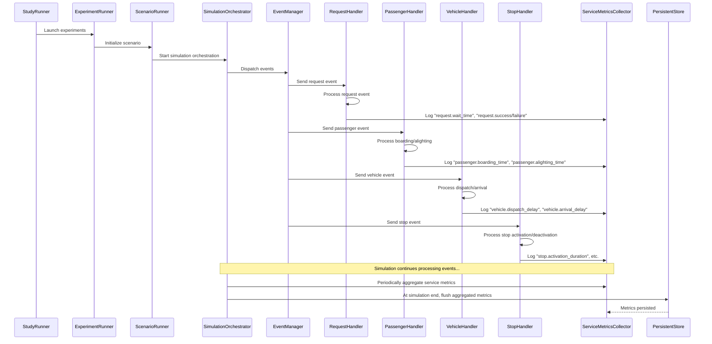

```mermaid
sequenceDiagram
    participant SR as StudyRunner
    participant ER as ExperimentRunner
    participant ScR as ScenarioRunner
    participant SO as SimulationOrchestrator
    participant EM as EventManager
    participant RH as RequestHandler
    participant PH as PassengerHandler
    participant VH as VehicleHandler
    participant SH as StopHandler
    participant MC as ServiceMetricsCollector
    participant PS as PersistentStore

    %% Study, Experiment, and Scenario Initialization
    SR->>ER: Launch experiments
    ER->>ScR: Initialize scenario
    ScR->>SO: Start simulation orchestration

    %% Event Dispatch and Handling
    SO->>EM: Dispatch events
    EM->>RH: Send request event
    RH->>RH: Process request event
    RH->>MC: Log "request.wait_time", "request.success/failure"
    
    EM->>PH: Send passenger event
    PH->>PH: Process boarding/alighting
    PH->>MC: Log "passenger.boarding_time", "passenger.alighting_time"
    
    EM->>VH: Send vehicle event
    VH->>VH: Process dispatch/arrival
    VH->>MC: Log "vehicle.dispatch_delay", "vehicle.arrival_delay"
    
    EM->>SH: Send stop event
    SH->>SH: Process stop activation/deactivation
    SH->>MC: Log "stop.activation_duration", etc.
    
    %% Metrics Aggregation and Persistence
    note over SO,MC: Simulation continues processing events...
    SO->>MC: Periodically aggregate service metrics
    SO->>PS: At simulation end, flush aggregated metrics
    PS-->>MC: Metrics persisted

```