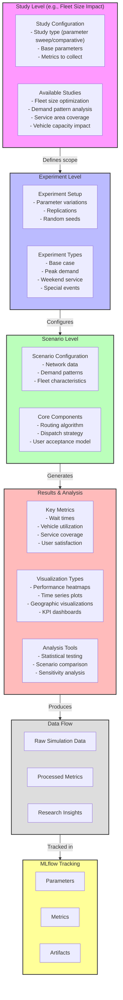

```mermaid
flowchart TD
    subgraph Study["Study Level (e.g., Fleet Size Impact)"]
        StudyConfig["Study Configuration\n- Study type (parameter sweep/comparative)\n- Base parameters\n- Metrics to collect"]
        Studies["Available Studies\n- Fleet size optimization\n- Demand pattern analysis\n- Service area coverage\n- Vehicle capacity impact"]
    end

    subgraph Experiments["Experiment Level"]
        ExpSetup["Experiment Setup\n- Parameter variations\n- Replications\n- Random seeds"]
        ExpTypes["Experiment Types\n- Base case\n- Peak demand\n- Weekend service\n- Special events"]
    end

    subgraph Scenarios["Scenario Level"]
        ScenConfig["Scenario Configuration\n- Network data\n- Demand patterns\n- Fleet characteristics"]
        Components["Core Components\n- Routing algorithm\n- Dispatch strategy\n- User acceptance model"]
    end

    subgraph Results["Results & Analysis"]
        Metrics["Key Metrics\n- Wait times\n- Vehicle utilization\n- Service coverage\n- User satisfaction"]
        Visualization["Visualization Types\n- Performance heatmaps\n- Time series plots\n- Geographic visualizations\n- KPI dashboards"]
        Analysis["Analysis Tools\n- Statistical testing\n- Scenario comparison\n- Sensitivity analysis"]
    end

    Study --> |"Defines scope"| Experiments
    Experiments --> |"Configures"| Scenarios
    Scenarios --> |"Generates"| Results

    subgraph DataFlow["Data Flow"]
        Raw["Raw Simulation Data"]
        Processed["Processed Metrics"]
        Insights["Research Insights"]
    end

    Results --> |"Produces"| DataFlow

    subgraph MLflow["MLflow Tracking"]
        Params["Parameters"]
        Metrics2["Metrics"]
        Artifacts["Artifacts"]
    end

    DataFlow --> |"Tracked in"| MLflow

    style Study fill:#f9f,stroke:#333,stroke-width:2px
    style Experiments fill:#bbf,stroke:#333,stroke-width:2px
    style Scenarios fill:#bfb,stroke:#333,stroke-width:2px
    style Results fill:#fbb,stroke:#333,stroke-width:2px
    style DataFlow fill:#ddd,stroke:#333,stroke-width:2px
    style MLflow fill:#ff9,stroke:#333,stroke-width:2px
```