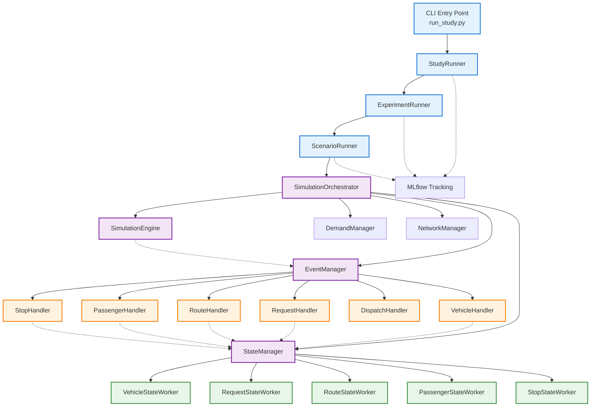

```mermaid
graph TD
    %% Main Components
    CLI[CLI Entry Point<br/>run_study.py]
    SR[StudyRunner]
    ER[ExperimentRunner]
    SCR[ScenarioRunner]
    SO[SimulationOrchestrator]
    SE[SimulationEngine]
    SM[StateManager]
    EM[EventManager]
    
    %% State Workers
    SW_V[VehicleStateWorker]
    SW_R[RequestStateWorker]
    SW_RT[RouteStateWorker]
    SW_P[PassengerStateWorker]
    SW_S[StopStateWorker]
    
    %% Event Handlers
    EH_V[VehicleHandler]
    EH_R[RequestHandler]
    EH_RT[RouteHandler]
    EH_P[PassengerHandler]
    EH_D[DispatchHandler]
    EH_S[StopHandler]
    
    %% Other Components
    DM[DemandManager]
    NM[NetworkManager]
    ML[MLflow Tracking]
    
    %% Hierarchical Relationships
    CLI --> SR
    SR --> ER
    ER --> SCR
    SCR --> SO
    SO --> SE
    SO --> SM
    SO --> EM
    SO --> DM
    SO --> NM
    
    %% State Management Relationships
    SM --> SW_V
    SM --> SW_R
    SM --> SW_RT
    SM --> SW_P
    SM --> SW_S
    
    %% Event Handler Relationships
    EM --> EH_V
    EM --> EH_R
    EM --> EH_RT
    EM --> EH_P
    EM --> EH_D
    EM --> EH_S
    
    %% Cross-Component Interactions
    SR -.-> ML
    ER -.-> ML
    SCR -.-> ML
    
    EH_V -.-> SM
    EH_R -.-> SM
    EH_RT -.-> SM
    EH_P -.-> SM
    EH_S -.-> SM
    
    SE -.-> EM
    
    %% Styling
    classDef primary fill:#e3f2fd,stroke:#1976d2,stroke-width:2px
    classDef secondary fill:#f3e5f5,stroke:#7b1fa2,stroke-width:2px
    classDef tertiary fill:#e8f5e9,stroke:#388e3c,stroke-width:2px
    classDef quaternary fill:#fff3e0,stroke:#f57c00,stroke-width:2px
    
    class CLI,SR,ER,SCR primary
    class SO,SE,SM,EM secondary
    class SW_V,SW_R,SW_RT,SW_P,SW_S tertiary
    class EH_V,EH_R,EH_RT,EH_P,EH_D,EH_S quaternary
```