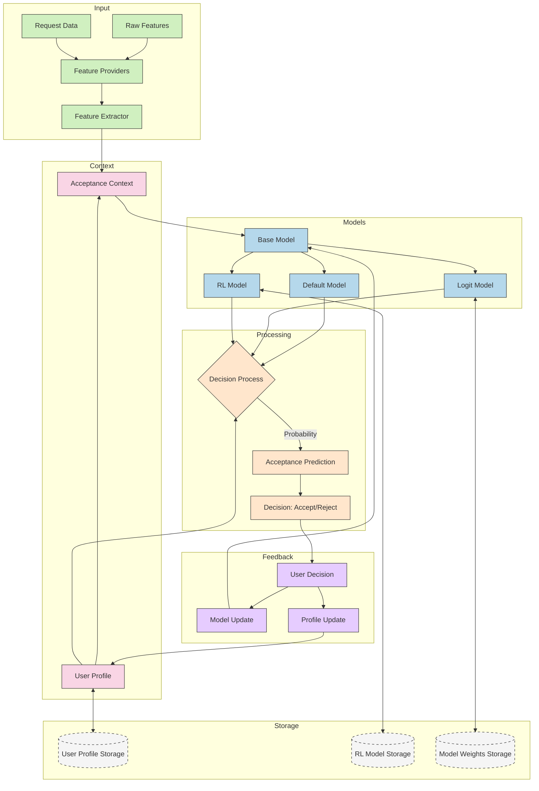

```mermaid
flowchart TD
    subgraph Input
        A[Raw Features] --> B[Feature Providers]
        C[Request Data] --> B
        B --> D[Feature Extractor]
    end

    subgraph Context
        D --> E[Acceptance Context]
        F[User Profile] --> E
    end

    subgraph Models
        E --> G[Base Model]
        G --> H[Default Model]
        G --> I[Logit Model] 
        G --> J[RL Model]
    end

    subgraph Processing
        H --> K{Decision Process}
        I --> K
        J --> K
        F --> K
        K -- Probability --> L[Acceptance Prediction]
        L --> M[Decision: Accept/Reject]
    end

    subgraph Feedback
        M --> N[User Decision]
        N --> O[Model Update]
        O --> G
        N --> P[Profile Update]
        P --> F
    end

    subgraph Storage
        F <--> Q[(User Profile Storage)]
        J <--> R[(RL Model Storage)]
        I <--> S[(Model Weights Storage)]
    end

    %% Style definitions
    classDef input fill:#d0f0c0,stroke:#333,stroke-width:1px
    classDef context fill:#f9d5e5,stroke:#333,stroke-width:1px
    classDef models fill:#b5d8eb,stroke:#333,stroke-width:1px
    classDef processing fill:#ffe6cc,stroke:#333,stroke-width:1px
    classDef feedback fill:#e6ccff,stroke:#333,stroke-width:1px
    classDef storage fill:#f5f5f5,stroke:#333,stroke-width:1px,stroke-dasharray: 5 5

    %% Apply styles
    class A,B,C,D input
    class E,F context
    class G,H,I,J models
    class K,L,M processing
    class N,O,P feedback
    class Q,R,S storage
```