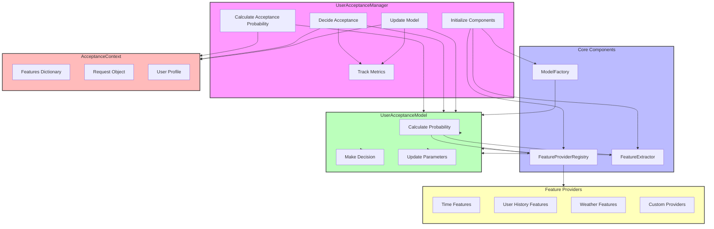

# User Acceptance Model Architecture

## Overview

The User Acceptance Model system is designed to predict whether users will accept proposed transportation services in a demand-responsive transportation (DRT) simulation. This document explains the architecture, components, data flow, and interactions within the system.

## Architecture Components

The architecture consists of five main components:

1. **UserAcceptanceManager**: Central coordinator that manages models and decisions
2. **FeatureProviderRegistry**: Collects raw data from various sources
3. **FeatureExtractor**: Normalizes and formats features for model consumption
4. **ModelFactory**: Creates and configures acceptance models
5. **AcceptanceContext**: Encapsulates all information needed for decision-making

## Component Relationships



## Detailed Component Descriptions

### 1. UserAcceptanceManager

**Purpose**: Central coordinator for user acceptance functionality.

**Responsibilities**:
- Initialize and configure all components
- Calculate acceptance probabilities for service offers
- Make acceptance decisions
- Update models with observed user decisions
- Track and report acceptance metrics

**Key Methods**:
- `calculate_acceptance_probability(request, service_attributes)`: Predicts likelihood of acceptance
- `decide_acceptance(request, service_attributes)`: Makes binary acceptance decision
- `update_model(request, accepted, service_attributes)`: Updates model with actual decisions
- `get_metrics()`: Returns acceptance statistics

### 2. FeatureProviderRegistry

**Purpose**: Collects raw data from various sources to support acceptance decisions.

**Responsibilities**:
- Register and manage feature providers
- Collect raw feature data from all relevant providers
- Provide a unified interface for accessing diverse data sources

**Providers**:
- **TimeBasedFeatureProvider**: Time of day, day of week, peak hours
- **UserHistoryFeatureProvider**: User's past behavior and preferences
- **WeatherFeatureProvider**: Current and forecasted weather conditions
- **CustomProviders**: Domain-specific providers that can be added dynamically

**Key Methods**:
- `register_provider(name, provider)`: Adds a new data source
- `get_features(request, context)`: Collects features from all sources
- `get_all_feature_names()`: Lists available features

### 3. FeatureExtractor

**Purpose**: Normalizes and formats raw feature data for model consumption.

**Responsibilities**:
- Maintain feature metadata (units, normalization values)
- Extract and normalize features from raw data
- Convert feature dictionaries to vector representations
- Handle missing or invalid feature values

**Key Methods**:
- `extract_features_dict(features, request, user_profile)`: Normalizes features as a dictionary
- `extract_features_vector(features, request, user_profile)`: Normalizes features as a vector
- `get_feature_metadata(feature_name)`: Returns metadata for a feature

### 4. ModelFactory

**Purpose**: Creates and configures user acceptance models.

**Responsibilities**:
- Register available model types
- Create model instances with proper configuration
- Provide dependency injection for models
- Load pre-trained models if available

**Key Methods**:
- `register_model_type(name, model_class)`: Registers a new model type
- `create_model(model_type, config, feature_extractor, feature_provider_registry)`: Creates a model instance
- `get_available_model_types()`: Lists available model types

### 5. AcceptanceContext

**Purpose**: Encapsulates all information needed for acceptance decisions.

**Responsibilities**:
- Store feature values
- Store reference to the original request
- Store reference to the user profile
- Provide interface for accessing and manipulating features

**Key Methods**:
- `from_assignment(request, service_attributes, user_profile)`: Creates context from service offer
- `add_feature(name, value)`: Adds a single feature
- `add_features(features)`: Adds multiple features
- `get_feature(name, default)`: Gets a feature value

## Data Flow and Interactions

### 1. Initialization Flow

```
1. UserAcceptanceManager is created
2. Manager initializes FeatureProviderRegistry and registers providers
3. Manager initializes FeatureExtractor with configuration
4. Manager uses ModelFactory to create the appropriate model
5. Model receives references to both registry and extractor
```

### 2. Prediction Flow

```
1. Manager receives a request and service attributes
2. Manager creates an AcceptanceContext with service attributes
3. Manager passes context to the model
4. Model uses registry to gather additional data (time, user, weather)
5. Model uses extractor to normalize features
6. Model computes and returns acceptance probability
```

### 3. Decision Flow

```
1. Manager receives a request and service attributes
2. Manager creates an AcceptanceContext with service attributes
3. Manager passes context to the model
4. Model makes binary decision based on probability
5. Manager records decision in metrics
6. Manager returns decision and probability
```

### 4. Update Flow

```
1. Manager receives actual user decision
2. Manager creates AcceptanceContext from service attributes
3. Manager passes context and decision to model
4. Model updates its parameters based on observed decision
5. Manager updates acceptance metrics
```

## Feature Processing Pipeline

The feature processing follows this pipeline:

1. **Collection**: `FeatureProviderRegistry` collects raw data from various sources
2. **Enrichment**: Providers add domain-specific derived features
3. **Extraction**: `FeatureExtractor` extracts relevant features based on configuration
4. **Normalization**: Extractor normalizes features to consistent scales
5. **Vectorization**: Extractor converts features to vector format if needed
6. **Decision**: Model uses processed features to make predictions

## Extending the System

### Adding a New Feature Provider

1. Create a new class inheriting from `FeatureProvider`
2. Implement the `get_features()` method
3. Implement the `get_feature_names()` method
4. Register the provider in the `UserAcceptanceManager`

### Adding a New Feature

1. Update the `DEFAULT_FEATURE_REGISTRY` in `FeatureExtractor`
2. Add the feature to appropriate provider(s)
3. Ensure proper extraction and normalization logic

### Adding a New Model Type

1. Create a class implementing the `UserAcceptanceModel` interface
2. Register the model type in `ModelFactory`
3. Ensure the model properly uses registry and extractor

## Potential Improvements

### 1. Unified Feature Manager

A unified `FeatureManager` could combine the functionality of `FeatureProviderRegistry` and `FeatureExtractor` for a more streamlined interface:

```python
# Create a feature manager
feature_manager = FeatureManager()

# Register feature sources
feature_manager.register_provider("time", TimeFeatureProvider())
feature_manager.register_provider("user", UserHistoryProvider())
feature_manager.register_provider("weather", WeatherFeatureProvider())

# Collect data and extract features in one step
features_dict = feature_manager.extract_features(
    request=request, 
    context=context, 
    user_profile=user_profile
)
```

Benefits of this approach:
- Single point of configuration for feature handling
- Clearer data flow from raw collection to normalized features
- Reduced code duplication
- More explicit relationship between providers and features
- Easier to add new features that depend on multiple providers

### 2. Feature Dependencies

Add explicit support for feature dependencies:

```python
# Define a feature that depends on other features
feature_manager.register_feature(
    FeatureDefinition(
        name="speed",
        dependencies=["distance", "time"],
        extractor_fn=lambda data, req, user: data.get("distance") / data.get("time") if data.get("time") else None
    )
)
```

### 3. Model-Specific Features

Allow models to specify which features they need:

```python
class MyAcceptanceModel(UserAcceptanceModel):
    @classmethod
    def required_features(cls):
        return ["waiting_time", "price", "time_of_day"]
        
# Feature manager only collects and extracts required features
features = feature_manager.extract_features(
    request=request,
    context=context,
    feature_names=model.required_features()
)
```

### 4. Context Creation Helpers

Extract common context creation logic into helper methods:

```python
# In UserAcceptanceManager
def _create_context(self, request, service_attributes, user_profile=None):
    """Centralized context creation with proper logging and error handling."""
    context = AcceptanceContext.from_assignment(
        request=request,
        service_attributes=service_attributes,
        user_profile=user_profile
    )
    return context
```

### 5. Incremental Learning

Enhance the update mechanism to support incremental learning:

```python
# Update model incrementally with a single example
model.update_incrementally(context, accepted)

# Batch update with option for incremental learning
model.batch_update(examples, incremental=True)
```

## Conclusion

The User Acceptance Model architecture provides a flexible and extensible system for predicting user acceptance of transportation services. The clear separation of concerns between data collection, feature processing, and decision-making allows for easy maintenance and extension as requirements evolve.

The recommended unified `FeatureManager` approach would streamline the interaction between components while maintaining the modularity and flexibility of the current design. This improvement would make the system easier to understand, maintain, and extend.